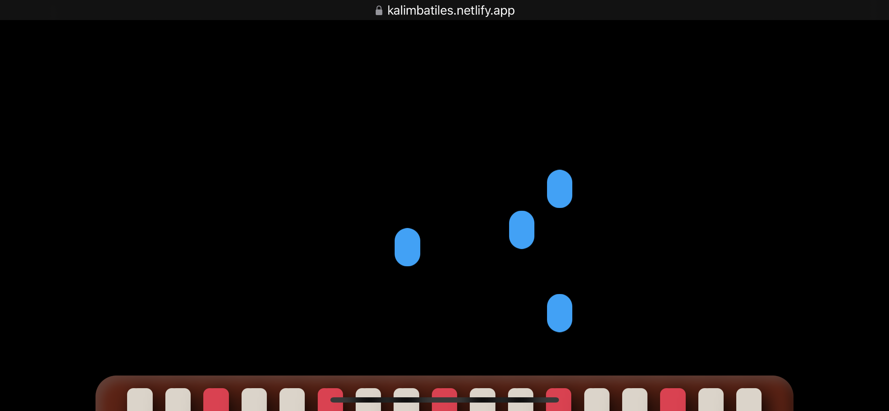
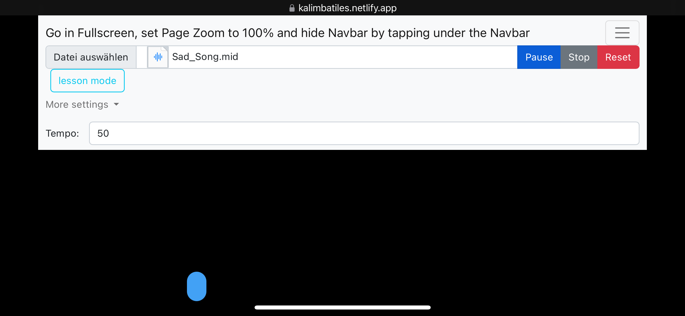
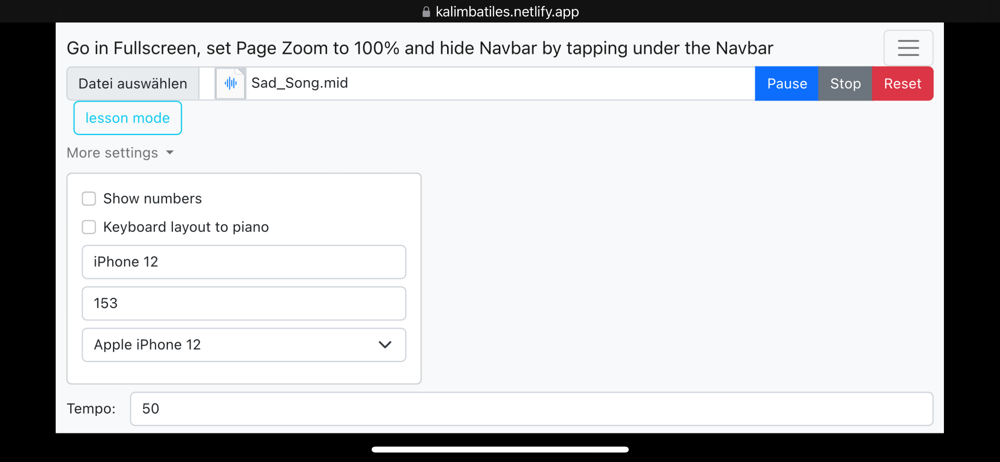
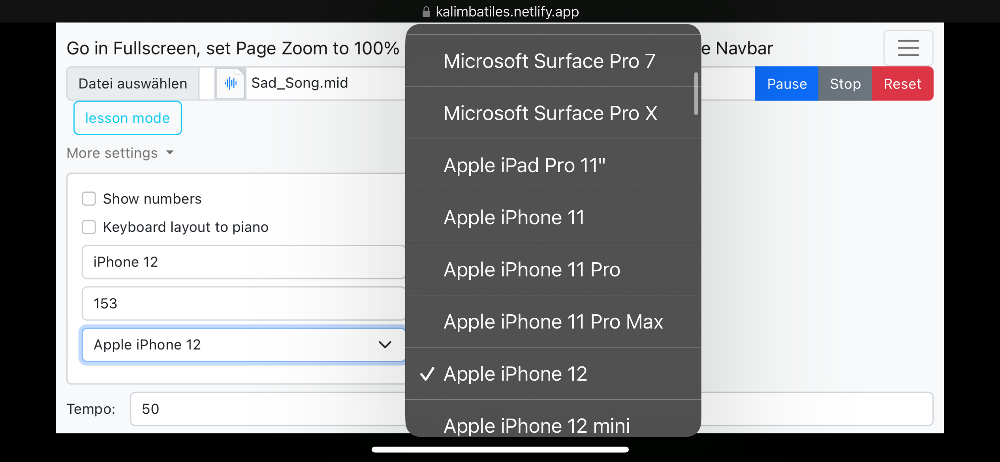

# Kalimba Tiles

Welcome to Kalimba Tiles, your go-to app for practicing and mastering the enchanting melodies of the kalimba. Whether you're a beginner or an experienced player, this app is designed to enhance your Kalimba learning experience.

## Usage:

1. **Fullscreen and Landscape Mode**: Optimize your practice by turning the page into fullscreen and landscape mode.
2. **Select a File**: Choose your favorite song or exercise by using the file selector.
3. **Click Play!**: Dive into your Kalimba practice session with a simple click.
4. **Hide Navigation Bar**: Tap under the navigation bar to hide it and immerse yourself completely in the music.
5. **Have Fun Learning**: Enjoy learning new songs and honing your kalimba skills.

## Updating:

Stay tuned for exciting updates and improvements. Here's a glimpse of what's in the pipeline:

- [x]  **Notes Setting Function**: Customize your learning experience with adjustable note settings.
- [x]  **Keyboard Integration**: Connect seamlessly with your keyboard for enhanced control.
- [x]  **Device Selection**: Fine-tune your experience with device-specific settings. Check out the [device selection settings](https://yesviz.com/viewport/).
- [x]  **Improve Navbar**: To make settings with less effort and a visual nice UI.
- [x]  **Support semitones**: To be able to play various songs.
- [ ]  *Support tunings**: To be able to play a big variety of songs.
- [ ]  **Automatic Note Length Adjustment**: Effortlessly adjust note length for a more dynamic playing experience.
- [ ]  **English and additional code comments**: So everyone understands the code and everything is explained.
- [ ]  **Color Settings**: Personalize the app interface with customizable color settings.
- [ ]  ~~**Navbar hide Button**: A button do hide and unhide the navbar.~~

## Libraries Used:

The following libraries power Kalimba Tiles:

- [MidiPlayerJS](https://github.com/grimmdude/MidiPlayerJS): A versatile MIDI player for seamless integration of MIDI files.
- [soundfont-player](https://github.com/danigb/soundfont-player): Enhance your kalimba sounds with this flexible SoundFont player.
- [Bootstrap](https://getbootstrap.com/): Utilizing the power of Bootstrap for a responsive and visually appealing user interface.

Feel the rhythm, embrace the melody, and let Kalimba Tiles be your companion on your musical journey!

## Links and Screenshots:

- [**App Link**](https://kalimbatiles.netlify.app/)
- [**YouTube Demo Video**](https://www.youtube.com/watch?v=q6G1YihTOLI&ab_channel=KeyKalimba)

### Screenshots:

