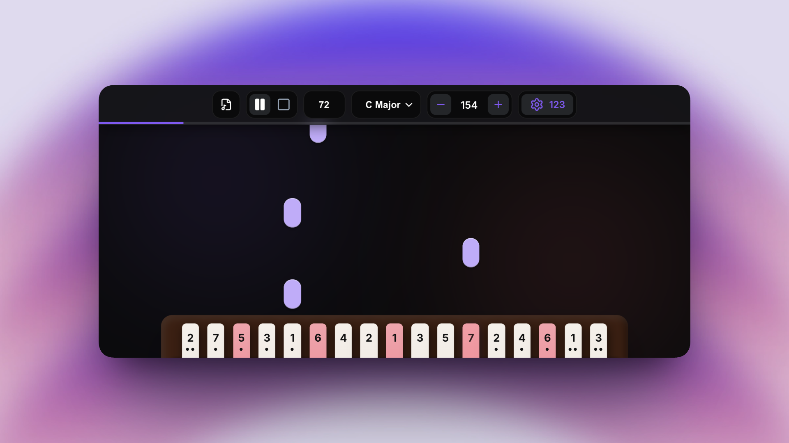

# Kalimba Tiles

Welcome to Kalimba Tiles, your go-to app for practicing and mastering the enchanting melodies of the kalimba. Whether you're a beginner or an experienced player, this app is meticulously crafted to enhance your Kalimba learning experience.

Recently modernized into a robust React/Vite application, Kalimba Tiles now features beautiful glowing aesthetics, perfect mathematical visual synchronization, and device-specific rendering scales. 

## Features & Usage

1. **Dynamic Physical Scaling**: Optimize your practice by selecting your exact device (e.g. iPhone 16 Pro, Galaxy S24). The on-screen UI will mathematically scale so the digital keys match the physical width of your real 17-key Kalimba when mounted. 
   *(Device CSS PPI specifications carefully derived using hardware dimensions sourced from [GSMArena](https://www.gsmarena.com/))*
2. **Select a File**: Choose your favorite `.mid` song or exercise effortlessly using the built-in file selector.
3. **Perfect Audio-Visual Sync**: Dive into your Kalimba practice session with falling tiles that strike the keys in perfect, millisecond-accurate rhythm with the audio.
4. **Tempo & Controls**: Adjust the learning speed dynamically, toggle note numbers/dots, and pause/play with a single click.
5. **Have Fun Learning**: Enjoy discovering new songs and refining your kalimba skills.

## Screenshot

 

## Local Development

Kalimba Tiles is built with a modern web stack: **React (TypeScript), Vite, and Vanilla CSS**.

To run the application locally:
```bash
# Install dependencies
npm install

# Start the Vite development server
npm run dev
```

## Libraries Used

Kalimba Tiles harnesses the power of the following libraries:
- [React](https://react.dev/) & [Vite](https://vitejs.dev/) - For lightning-fast UI rendering and development.
- [Lucide React](https://lucide.dev/) - Beautiful, consistent iconography.
- [MidiPlayerJS](https://github.com/grimmdude/MidiPlayerJS): A versatile MIDI player for seamless integration of MIDI files.
- [soundfont-player](https://github.com/danigb/soundfont-player): Enhance your kalimba sounds with this flexible SoundFont player.

## License

This project is licensed under the [GNU Affero General Public License v3.0](LICENSE) - see the [LICENSE](LICENSE) file for details.

Feel the rhythm, embrace the melody, and let Kalimba Tiles be your companion on your musical journey!
